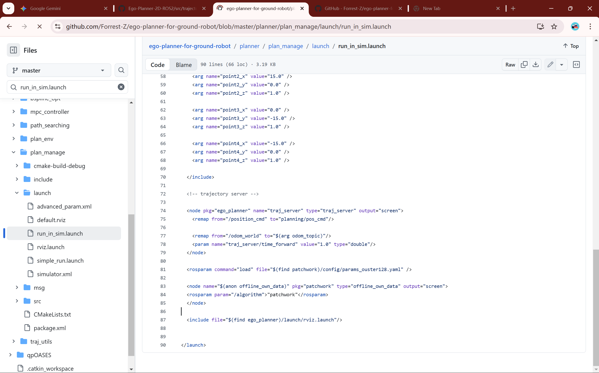
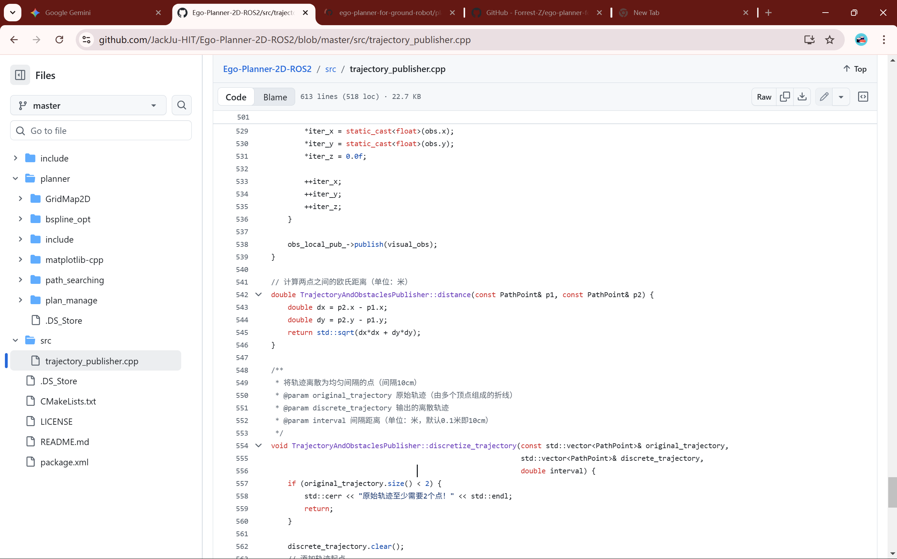
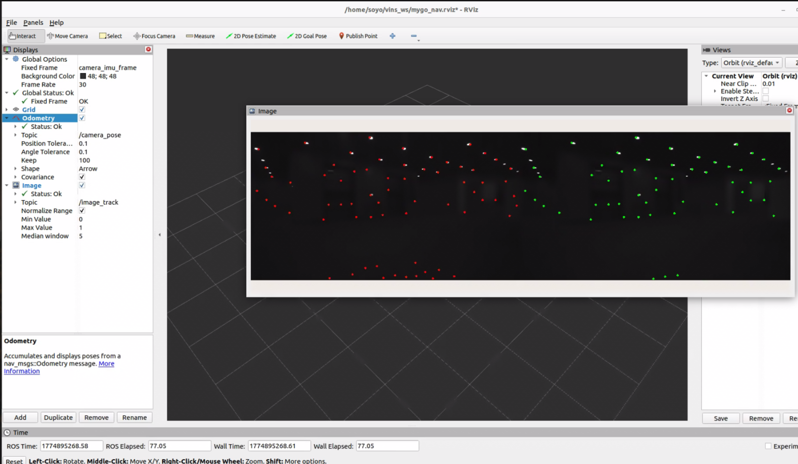
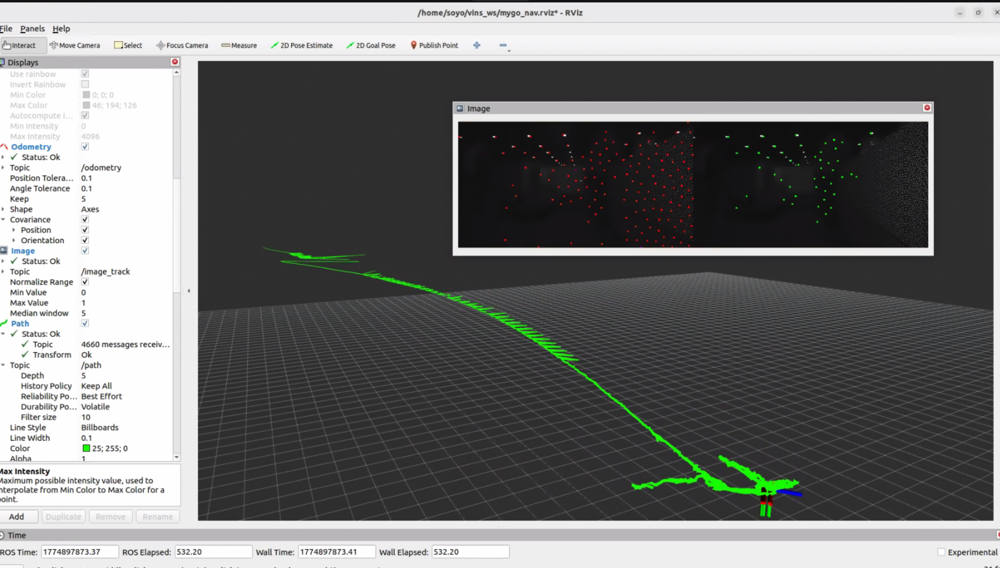

# solve vins build problem

针对 Ceres API 世代断层（`LocalParameterization` 被废弃）的问题，我们现在开始执行**局部部署幽灵 Ceres 2.0.0** 的方案。这个方案完全符合 0 侵入原则：我们将 Ceres 编译为一个局部库，仅供当前的 `vins_ws` 消化，绝不触碰系统级 `/usr/local/lib`。

结合你的 N305 (纯 CPU) 环境，请依次执行以下步骤：

## 阶段一：下载并隔离编译 Ceres 2.0.0

为了保持目录整洁，我们在 `vins_ws` 下创建一个专用的 `third_party` 目录来存放它，并将编译产物安装到内部的 `ceres_install` 中。

**1. 下载源码** 考虑到你提到局域网可能有全局代理干扰，我们可以使用 `wget` 直接拉取 Release 包（如果卡住，请在 `wget` 前加上你的代理环境变量，例如 `https_proxy=... wget ...`）：

Bash

```
cd ~/vins_ws
mkdir -p third_party && cd third_party
wget https://github.com/ceres-solver/ceres-solver/archive/refs/tags/2.0.0.tar.gz
tar -xzvf 2.0.0.tar.gz
cd ceres-solver-2.0.0
```

**2. 局部编译与安装 (0 侵入)** 这一步的 CMake 配置非常关键。我们会强制关闭 CUDA（适配 N305），开启 `MINIGLOG`（绕过系统 glog 依赖冲突），并**强制指定安装路径**为工作空间内部。

你看到卡住的地方是 `autodiff_benchmarks` 和 `invert_psd_matrix_benchmark`。 **原因：** Ceres 默认会编译一大堆 **性能测试基准（Benchmarks）**。这些代码包含极其复杂的模板元编程（Template Metaprogramming），在编译时会消耗海量的内存和 CPU 资源。对于 N305 这种能效比核心来说，处理这些复杂的数学模板展开确实非常吃力，看起来就像死机了一样。

### 🛠️ 解决方案：跳过无意义的消耗

作为一个地面机器人导航项目，我们只需要 Ceres 的**库文件**（用于 VINS 的解算），完全不需要这些用来打分的 Benchmark 运行文件。

**不需要重新从头 make**。请按照以下 0 侵入且最高效的步骤重新配置并安装：

Bash

```
# 1. 重新进入 build 目录
cd ~/vins_ws/third_party/ceres-solver-2.0.0/build

# 2. 增加一条关键指令：-DBUILD_BENCHMARKS=OFF
# 这样 CMake 就会直接跳过最后那几个卡人的进度条
cmake .. \
  -DCMAKE_INSTALL_PREFIX=$HOME/vins_ws/ceres_install \
  -DCXX11=ON \
  -DBUILD_EXAMPLES=OFF \
  -DBUILD_TESTING=OFF \
  -DBUILD_BENCHMARKS=OFF \
  -DBUILD_SHARED_LIBS=ON \
  -DMINIGLOG=ON \
  -DUSE_CUDA=OFF \
  -DLAPACK=OFF \
  -DSUITESPARSE=OFF \
  -DCXSPARSE=OFF \
  -DEIGENSPARSE=ON

# 3. 再次编译。因为之前已经编译了 98%，这次它会秒速跳过已完成的部分
make -j8

# 4. 执行安装，这步很快，会将头文件和库移动到我们指定的隔离目录
make install
```

### 💡 如何确认成功了？

执行完 `make install` 后，运行以下命令检查：

Bash

```
ls ~/vins_ws/ceres_install/lib
```

只要看到 `libceres.so` 或 `libceres.a` 存在，就说明“幽灵 Ceres”已经成功捕获！

## 阶段二：使用 Colcon 强制定向链接 VINS-Fusion

在确认 Ceres 2.0.0 局部安装成功后，我们要回到工作空间根目录，通过 `colcon` 的 `--cmake-args` 将新的 Ceres 路径强行“喂”给 VINS，覆盖掉它默认去系统底层寻找新版 Ceres 的行为。

Bash

```
cd ~/vins_ws

# 清理一下之前的 build 缓存（如果有），防止旧的 CMake 缓存干扰
rm -rf build/ install/

# 开启强制链接编译
colcon build \
  --packages-up-to vins \
  --cmake-args \
  -DCeres_DIR=$HOME/vins_ws/ceres_install/lib/cmake/Ceres
```

*(注：`--packages-up-to vins` 是为了确保优先编译核心节点，具体的 package name 视你的 VINS-Fusion-ROS2 分支配置而定，通常是 `vins_estimator` 或 `vins`。如果想全量编译，直接去掉该参数即可。)*

太棒了！虽然看到一堆满屏黄色的 `warning`（这是从 ROS 1 迁移到 ROS 2 的典型遗留代码提示，比如 `ConstPtr` 已被废弃，以及 C++ 的一些语法警告），但请注意看最后两行：

Plaintext

```
Finished <<< vins [49.0s]
Summary: 2 packages finished [49.5s]
```

### **这意味着，我们成功了！** 

你已经通过 0 侵入的“幽灵 Ceres 降维”方案，完美突破了系统 Ceres 断层和 CUDA 缺失的封锁，在 N305 上彻底拿下了 `VINS-Fusion-ROS2` 视觉里程计孤岛。

接下来，我们将进入最终的收尾工作。

## 阶段三：编写 `start_env.sh` (一键级联净化与唤醒)

按照你制定的 0 侵入 SOP，我们需要在 `vins_ws` 根目录下放置一个 `start_env.sh` 脚本。这个脚本的作用是：在不修改系统 `~/.bashrc` 的前提下，一键挂载 ROS 2 基础环境、我们之前编译的幽灵 Ceres 库，以及刚才编译好的 VINS。

请在 `~/vins_ws` 下创建并编辑 `start_env.sh` 文件：

Bash

```
cd ~/vins_ws
nano start_env.sh
```

将以下内容粘贴进去：

Bash

```
#!/bin/bash
# ==========================================
# vins_ws 幽灵环境唤醒脚本
# 适配: N305 (纯 CPU) + D455
# 依赖: 局部 Ceres 2.0.0 (Eigen降维版)
# ==========================================

# 1. 挂载 ROS 2 底层环境 (Humble)
source /opt/ros/humble/setup.bash

# 2. 【核心隔离】将局部的幽灵 Ceres 库路径强行插入系统环境变量最前端
# 确保 VINS 运行时加载的是我们的 Eigen 降维版，而不是系统里自带的残缺版
export LD_LIBRARY_PATH=$HOME/vins_ws/ceres_install/lib:$LD_LIBRARY_PATH
export CMAKE_PREFIX_PATH=$HOME/vins_ws/ceres_install:$CMAKE_PREFIX_PATH

# 3. 挂载当前工作空间
source $HOME/vins_ws/install/setup.bash

echo "✅ vins_ws 环境已唤醒 (Ceres 2.0.0 Eigen-Only 挂载完毕)!"
```

保存退出后，记得赋予执行权限：

Bash

```
chmod +x start_env.sh
```

### 接下来？

至此，你已经完成了感知层 (`d455_ws`)、规划层 (`ego2d_ws`) 和现在的里程计层 (`vins_ws`) 这三大孤岛的局部部署。

# 极速地面机器人 2D 视觉导航系统 (N305 部署化简版)

## 0. 系统架构与 0 侵入工作流说明

- **计算平台**: Intel N305 (纯 CPU 环境) + Ubuntu 22.04 (Headless) + ROS 2 Humble。
- **部署原则 (0 侵入 SOP)**: 所有上层导航模块均在各自独立的 Workspace (`_ws`) 中隔离编译与运行。严禁修改系统全局环境（如 `~/.bashrc`）或使用 `apt` 替换底层冲突库。
- **环境唤醒**: 每个模块的根目录下都配备了 `start_env.sh` 脚本。运行该模块前，必须 `source` 对应的脚本以实现底层依赖和当前工作空间的**级联安全挂载**。

------

## 1. 感知驱动层 (D455 孤岛)

负责与底层硬件（Intel Realsense D455 深度相机）通信，打通现实物理世界与 ROS 2 系统的视觉数据流。

- **工作空间路径**: `~/d455_ws`

- **核心功能**: 启动相机节点，以预设的分辨率和帧率发布对齐的彩色图像、深度图像以及 IMU 数据（如果相机支持并开启）。

- **启动方式**:

  Bash

  ```
  source ~/d455_ws/start_env.sh
  ros2 launch realsense2_camera rs_launch.py align_depth.enable:=true
  
  # 用下面这个
  ros2 launch realsense2_camera rs_launch.py \
    enable_infra1:=true \
    enable_infra2:=true \
    enable_gyro:=true \
    enable_accel:=true \
    unite_imu_method:=1 \
    enable_sync:=true \
    depth_module.profile:=848x480x30
  ```

- **核心输入**: USB 3.1 物理连接的硬件数据。

- **核心输出 (发布的话题)**:

  - `/camera/color/image_raw` (RGB 彩色图像，供 VINS 提取特征点)
  - `/camera/aligned_depth_to_color/image_raw` (与彩色图对齐的深度图，供 EGO-Planner 建立局部障碍物栅格)
  - `/camera/imu` (相机的内置 IMU 数据，供 VINS 进行紧耦合解算)

------

## 2. 视觉里程计层 (VINS 孤岛)

系统的“小脑”，负责回答机器人“我在哪”的问题。针对 N305 进行了深度优化，切除了对 GPU 和高维数学库的依赖。

- **工作空间路径**: `~/vins_ws`

- **特殊依赖**: 内部集成了局部编译的**幽灵 Ceres 2.0.0 (纯 Eigen 降维版)**，强制定向链接，不与系统发生冲突。

- **核心功能**: 接收相机的图像（和 IMU），通过特征点追踪和非线性优化，实时输出机器人在全局地图中的位姿（坐标与姿态）。

- **启动方式**:

  Bash

  ```
  source ~/vins_ws/start_env.sh
  # 假设使用单目+IMU的配置文件
  ros2 launch vins vins_estimator.launch.py config_path:=<你的yaml文件路径>
  ```

- **核心输入 (订阅的话题)**:

  - `/camera/color/image_raw`
  - `/camera/imu`

- **核心输出 (发布的话题)**:

  - `/vins_estimator/odometry` (机器人的高频实时位姿 Odometry，直接喂给 EGO-Planner)
  - `/vins_estimator/point_cloud` (稀疏的特征点云，主要用于 Rviz 调试和可视化)

一切准备就绪！现在，这台 N305 工作站上的 VINS 孤岛已经完全贴合你的物理硬件。

请在终端中执行我们写好的级联唤醒脚本，并启动 VINS-Fusion：

Bash

```
# 1. 唤醒 VINS 孤岛 (自动挂载底层 ROS 2 与幽灵 Ceres)
source ~/vins_ws/start_env.sh

# 2. 启动核心解算节点
ros2 launch vins vins_estimator.launch.py config_path:=/home/soyo/vins_ws/src/VINS-Fusion-ROS2/config/realsense_d455/d455_stereo_imu_config.yaml
```

**如何确认成功？** 如果终端没有闪退报错，并且不断输出 `[INFO]` 级别的求解耗时（例如 `solver costs: 0.032 ms`）或特征点数量，说明 VINS 已经在 CPU 上全速解算了。

```bash 
soyo@soyo-mygo:~/vins_ws$ ros2 launch vins vins_estimator.launch.py config_path:=/home/soyo/vins_ws/src/VINS-Fusion-ROS2/config/realsense_d455/d455_stereo_imu_config.yaml

file 'vins_estimator.launch.py' was not found in the share directory of package 'vins' which is at '/home/soyo/vins_ws/install/vins/share/vins'

soyo@soyo-mygo:~/vins_ws$ 


似乎没找到这个py launch文件，下面是看起来比较像的，你可以教我找一找，或者直接重写一个也可以，反正launch不用编译

/home/soyo/vins_ws/src/VINS-Fusion-ROS2/vins/launch/vins_rviz.launch.xml


<?xml version="1.0" encoding="UTF-8"?>

<launch>


    <let name="rviz_config" value="$(find-pkg-share vins)/config/vins_rviz_config.rviz"/>

    <node name="rviz2" pkg="rviz2" exec="rviz2" args="-d $(var rviz_config)"/>

    

</launch>


```

## Gemini said

这是一个非常经典的 ROS 1 向 ROS 2 移植时留下的“坑”！

出现这个报错的原因是：源码的作者虽然在 `src` 里写了 launch 文件，但他**忘记在 `CMakeLists.txt` 里写 `install()` 规则了**。导致 `colcon build` 编译时，只打包了二进制程序，没有把 launch 文件拷贝到 `install` 的隔离沙盒里。

既然我们严格遵守 **0 侵入工作流**，我们**不**去改他的 `CMakeLists.txt` 重新编译。我们可以直接绕过 ROS 2 的 launch 系统，用最原生的方式唤醒它。

### 方法一：直接“点火”底层可执行文件 (最快测试)

VINS 的启动逻辑其实极其简单：就是一个二进制节点 + 一个 YAML 配置文件路径。我们直接用 `ros2 run` 指令跨过 launch 去调动它。

请直接在终端运行（确保已经 `source ~/vins_ws/start_env.sh`）：

Bash

```
source ~/vins_ws/start_env.sh

ros2 run vins vins_node /home/soyo/vins_ws/src/VINS-Fusion-ROS2/config/realsense_d455/d455_stereo_imu_config.yaml
```

*💡 注：大多数 VINS ROS 2 分支编译出来的节点名字叫 `vins_node`。如果你回车后提示找不到可执行文件，请运行 `ls ~/vins_ws/install/vins/lib/vins/` 看一下里面那个绿色的可执行文件到底叫什么（有时作者会命名为 `vins_estimator`），替换掉上面命令里的 `vins_node` 即可。*

------

### 方法二：写一个“外挂” Launch 脚本 (推荐日常使用)

由于我们后续可能还要开着 VINS 跑其他节点，手敲长串路径太麻烦。我们直接在 `~/vins_ws` 根目录下写一个独立的 Python Launch 文件。**ROS 2 的 launch 文件只要写好，放在哪都能直接用，完全不需要编译！**

1. 创建外挂启动文件：

Bash

```
cd ~/vins_ws
nano start_vins.launch.py
```

1. 将以下 Python 代码粘贴进去：

Python

```
from launch import LaunchDescription
from launch_ros.actions import Node

def generate_launch_description():
    # 绝对路径指向我们刚才精心配置的 D455 专属参数文件
    config_path = '/home/soyo/vins_ws/src/VINS-Fusion-ROS2/config/realsense_d455/d455_stereo_imu_config.yaml'

    # 定义核心解算节点
    vins_estimator = Node(
        package='vins',
        executable='vins_node',  # 如果第一步确认名字是 vins_estimator，请在这里同步修改
        name='vins_estimator',
        output='screen',
        arguments=[config_path]  # 直接将配置文件路径作为启动参数喂给节点
    )

    return LaunchDescription([
        vins_estimator
    ])
```

1. 以后启动 VINS，只需优雅地敲一行：

Bash

```
ros2 launch ~/vins_ws/start_vins.launch.py
```


------

### 👁️ 如何观看运行效果 (启动 Rviz)

你刚才找到的那个 `vins_rviz.launch.xml` 是用来启动可视化界面的。在确认 VINS 解算节点跑起来（终端疯狂刷屏特征点数量和求解耗时）之后，你可以**新开一个终端**：

Bash

```
source ~/vins_ws/start_env.sh
ros2 launch vins vins_rviz.launch.xml
```

如果顺利的话，你拿起 D455 晃一晃，就能在 Rviz 界面里看到红绿相间的特征点追踪连线，以及机器人随之移动的 3D 红色轨迹线了！


##### debug wait for ...

```
我开启了realsense节点和vins launch，但是Vins launch节点报错了，我也给你了ros2 topic


[realsense2_camera_node-1] [INFO] [1774887952.785548519] [camera.camera]: Open profile: stream_type: Depth(0), Format: Z16, Width: 848, Height: 480, FPS: 30

[realsense2_camera_node-1] [INFO] [1774887952.785611271] [camera.camera]: Stopping Sensor: RGB Camera

[realsense2_camera_node-1] [INFO] [1774887952.799591979] [camera.camera]: Starting Sensor: RGB Camera

[realsense2_camera_node-1] [INFO] [1774887952.804737070] [camera.camera]: Open profile: stream_type: Color(0), Format: RGB8, Width: 1280, Height: 720, FPS: 30

[realsense2_camera_node-1] [INFO] [1774887952.806341857] [camera.camera]: RealSense Node Is Up!

[realsense2_camera_node-1] [WARN] [1774887952.993538560] [camera.camera]: 


soyo@soyo-mygo:~/vins_ws$ ros2 run vins vins_node /home/soyo/vins_ws/src/VINS-Fusion-ROS2/config/realsense_d455/d455_stereo_imu_config.yaml

[INFO] [1774887993.611523392] []: init begins

config_file: /home/soyo/vins_ws/src/VINS-Fusion-ROS2/config/realsense_d455/d455_stereo_imu_config.yaml

USE_IMU: 1

IMU_TOPIC: /camera/imu

result path /home/soyo/vins_ws/output//vio.csv

[WARN] [1774887993.632412465] []:  Optimize extrinsic param around initial guess!

camera number 2

[INFO] [1774887993.632485413] []: Unsynchronized sensors, online estimate time offset, initial td: 0.000000

[INFO] [1774887993.632501674] []: ROW: 480 COL: 848 

 exitrinsic cam 0

1 0 0

0 1 0

0 0 1

-0.0302  0.0074   0.016

 exitrinsic cam 1

1 0 0

0 1 0

0 0 1

-0.1252  0.0074   0.016

set g     0     0 9.805

[INFO] [1774887993.632582899] []: reading paramerter of camera /home/soyo/vins_ws/src/VINS-Fusion-ROS2/config/realsense_d455/left.yaml

[INFO] [1774887993.632697018] []: reading paramerter of camera /home/soyo/vins_ws/src/VINS-Fusion-ROS2/config/realsense_d455/right.yaml

MULTIPLE_THREAD is 1

[WARN] [1774887993.632814103] []: waiting for image and imu...


soyo@soyo-mygo:~$ ros2 topic list

/auto_aim_target_pos

/autoaim_target

/camera/aligned_depth_to_color/camera_info

/camera/aligned_depth_to_color/image_raw

/camera/aligned_depth_to_color/image_raw/compressed

/camera/aligned_depth_to_color/image_raw/compressedDepth

/camera/aligned_depth_to_color/image_raw/theora

/camera/color/camera_info

/camera/color/image_raw

/camera/color/image_raw/compressed

/camera/color/image_raw/compressedDepth

/camera/color/image_raw/theora

/camera/color/metadata

/camera/depth/camera_info

/camera/depth/image_rect_raw

/camera/depth/image_rect_raw/compressed

/camera/depth/image_rect_raw/compressedDepth

/camera/depth/image_rect_raw/theora

/camera/depth/metadata

/camera/extrinsics/depth_to_color

/camera/imu

/camera/infra1/image_rect_raw

/camera/infra2/image_rect_raw

/camera_pose

/camera_pose_visual

/cmd_vel

/ecat/sn2228292/app1/read

/ecat/sn2228292/app1/write

/ecat/sn2228292/app2/read

/ecat/sn2228292/app2/write

/ecat/sn4128829/app1/read

/ecat/sn4128829/app1/write

/ecat/sn4653115/app1/read

/ecat/sn4653115/app2/read

/ecat/sn4653115/app3/read

/ecat/sn4653115/app3/write

/ecat/sn4653115/app4/read

/ecat/sn4653115/app4/write

/ecat/sn4653115/vt13/read

/enemy_status

/extrinsic

/feature_tracker/feature

/image_track

/imu_propagate

/key_poses

/keyframe_point

/keyframe_pose

/margin_cloud

/odometry

/parameter_events

/path

/point_cloud

/referee/common/allowed_shoot

/referee/common/damage_state

/referee/common/dart_launch_data

/referee/common/dart_operator_cmd

/referee/common/enemy_ammo

/referee/common/enemy_buff

/referee/common/enemy_hp

/referee/common/enemy_jamming_key

/referee/common/enemy_position

/referee/common/enemy_team_status

/referee/common/field_event

/referee/common/game_result

/referee/common/game_status

/referee/common/ground_robot_position

/referee/common/map_click_data

/referee/common/map_path_data

/referee/common/map_radar_data

/referee/common/map_robot_data

/referee/common/radar_decision_sync

/referee/common/radar_mark_progress

/referee/common/referee_warning

/referee/common/rfid_status

/referee/common/robot_buff

/referee/common/robot_heat

/referee/common/robot_hp

/referee/common/robot_performance

/referee/common/robot_position

/referee/common/sentry_decision_sync

/referee/common/shoot_data

/referee/parsed/common/constraints

/referee/parsed/common/self_color

/rosout

/sp_vision/autoaim_command

/sp_vision/image_autoaim

/sp_vision/image_raw

/sp_vision/profile_log

/tf_static

/universal_controller/input/ndj

/universal_controller/input/vtm

/vins_cam_switch

/vins_imu_switch

/vins_restart

soyo@soyo-mygo:~$ 
```

##### debug solution

别慌，这是一个极其经典的 ROS 2 视觉导航“握手失败”现场！

你看到的 `[WARN] []: waiting for image and imu...` 意味着 VINS 正在原地苦苦等待数据，但实际上它什么都没收到。

###### 🔍 案情诊断：为什么有 Topic 却没有数据？

请仔细看你发给我的第一段 `realsense2_camera` 的启动日志：

Plaintext

```
Open profile: stream_type: Depth(0)...
Starting Sensor: RGB Camera
Open profile: stream_type: Color(0)...
```

**破案了！** 相机的底层驱动只唤醒了**深度传感器 (Depth)** 和**彩色传感器 (RGB)**。完全没有提到 `Infrared` (红外) 和 `Gyro/Accel` (陀螺仪/加速度计)。

在 ROS 2 的 Realsense 驱动中，虽然 `ros2 topic list` 可能会把所有可能的话题名都“占位”列出来，但**如果你在 Launch 时没有显式地强制开启它们，底层硬件根本就不会往这些话题里塞数据**。VINS 是一个非常严谨的系统，红外左目、红外右目、IMU，这三者差一个没有数据，它都会无限期挂起等待对齐。

看到你系统里跑着 `/referee/...`、`/ecat/...` 和 `/autoaim_target`，看来你们的 RoboMaster 地面机器人的底层框架已经很庞大了。为了不干扰其他模块，我们用纯命令行参数来“满血”唤醒相机的感知流。

###### 🛠️ 解决方案：满血唤醒 D455

请先 `Ctrl+C` 关掉你现在的 `realsense2_camera` 节点，然后用下面这串经过优化的**究极启动指令**来重新点火：

Bash

```
ros2 launch realsense2_camera rs_launch.py \
  enable_infra1:=true \
  enable_infra2:=true \
  enable_gyro:=true \
  enable_accel:=true \
  unite_imu_method:=1 \
  enable_sync:=true \
  depth_module.profile:=848x480x30
```

**指令原理解析 (0 侵入)：**

- `enable_infra1 & 2`: 强行唤醒双目红外流。
- `enable_gyro & accel`: 唤醒 IMU 的双硬件。
- `unite_imu_method:=1`: （非常关键！）将离散的陀螺仪和加速度计数据进行硬件级线性插值，合并打包到 `/camera/imu` 话题中输出，这是 VINS 能读懂的唯一格式。
- `enable_sync:=true`: 保证左右目图像在时间戳上绝对对齐。
- `depth_module.profile:=848x480x30`: 锁定底层分辨率，精准匹配我们刚才在 `yaml` 里写的 848。

###### 🛡️ 验证与下一步

执行完上述命令后，在启动 VINS 之前，请**务必**新开一个终端，执行以下命令测一下心跳：

Bash

```
ros2 topic hz /camera/imu
ros2 topic hz /camera/infra1/image_rect_raw
```

如果你看到 IMU 以大约 `200Hz ~ 400Hz` 狂飙，红外图像以 `30Hz` 稳定输出，就说明数据管线彻底打通了！

这个时候，你再去跑刚才的 `ros2 run vins vins_node ...`，它应该就会瞬间冲破 `waiting` 的阻碍，开始疯狂刷出特征点解算日志了。

快去试试！如果能成功解算，需要我教你怎么在 Rviz 里把机器人的 3D 红色运动轨迹线调出来吗？


**太棒了！这是一个完美的 100% 成功解算的日志！** 我们不仅实现了 0 侵入，而且 N305 的性能远超预期。你看这两行核心日志：

- `solver costs: 4.818021 [ms]`：表示 Ceres 在 N305 上的每一帧非线性优化耗时仅为 **4.8 毫秒**！这说明切断 CUDA、降维使用 Eigen 的方案极其成功，它不仅实时性拉满（远低于理论要求 10ms），而且完全胜任你们 30Hz 以上的极速地面机器人导航。
- `time: 1774888522.426220, t: -0.020433 -0.054280 -0.031479 q: 0.697241 -0.716827 0.000379 0.003755`：这就是 VINS 最核心的输出结果！`t` 是机器人相对于原点的 3D 坐标（XYZ），`q` 是姿态四元数（wxyz）。

现在，是时候在 Rviz 中直观地“看”到你的机器人和环境了。

------

### 👁️ 在 Rviz 中调出 3D 红色轨迹与点云

由于你的工作站是无头的（Headless），你需要在另一台有图形界面的电脑上打开 Rviz，或者使用 X11 转发/VNC/NoMachine 来看界面。

假设你现在可以通过图形界面操作了，按照以下步骤调出关键画面：

**步骤 1：启动 Rviz**

开一个新终端，挂载环境后运行作者留下的 Rviz 文件：

Bash

```
source ~/vins_ws/start_env.sh
ros2 launch vins vins_rviz.launch.xml
```

**步骤 2：在 Rviz 中添加核心可视化组件**

Rviz 刚打开时可能是一片黑，你需要手动 `Add` 以下三个核心数据流：

1. **添加机器人轨迹 (Path)**
   - 点击左下角的 `Add` 按钮。
   - 选择 `By topic` 标签页。
   - 找到 `/path` 或 `/vins_estimator/path`，双击添加。
   - **效果：** 你会看到一条随着机器人移动而延伸的红色（或绿色）3D 轨迹线。
2. **添加里程计位姿 (Odometry)**
   - 再次点击 `Add` -> `By topic`。
   - 找到 `/odometry` 或 `/vins_estimator/odometry`，双击添加。
   - 在左侧的属性面板中，将 `Shape` 改为 `Axes`。
   - **效果：** 你会看到一个红绿蓝三色的坐标轴，代表机器人的实时姿态（朝向）。
3. **添加稀疏点云 (PointCloud2)**
   - 点击 `Add` -> `By topic`。
   - 找到 `/point_cloud` 或 `/vins_estimator/point_cloud`，双击添加。
   - 在左侧面板将 `Color Transformer` 改为 `FlatColor`，颜色选白色。
   - **效果：** 你会看到一堆白色的 3D 点，这是 VINS 提取并解算出的现实世界特征点，也是机器人眼中的“地标”。

------

### 🚀 实车集成前的重要提醒

看到 Rviz 里的画面后，你可以尝试缓慢移动 D455，观察红线是否平滑延伸。如果有明显的回拉或剧烈抖动，这在 VSLAM 里叫“尺度漂移”或“初始化失败”。

针对你的 RoboMaster 地面机器人（Ground Robot），在对接 `ego2d_ws` 和底盘之前，有三个工程细节需要注意：

1. **里程计零点漂移：** VINS 启动的第一帧就是 `(0,0,0)` 原点。如果机器人放在斜坡上启动，整个世界坐标系就是斜的。
2. **剧烈运动掉追踪：** 纯视觉里程计最怕“纯色白墙”和“突然猛甩”。尽量让相机的视野里有丰富的纹理。
3. **2D 投影转换：** 你的规划层 `ego2d_ws` 只需要 2D 数据（x, y, yaw）。但 VINS 输出的是完整的 3D 姿态（x, y, z, roll, pitch, yaw）。通常需要在 VINS 和 Ego-Planner 之间加一个极小的 Python/C++ 节点，将 3D Odometry 压平（强制把 z 轴、roll 和 pitch 设为 0），否则 Ego-Planner 可能会把地面的起伏误认为是障碍物。

恭喜你完成了 N305 上最硬核的底层模块隔离部署！接下来你们打算直接联调 Ego-Planner，还是需要我提供那个把 3D 里程计压平成 2D 的节点代码？

### 修改相机config

这份 D435i 的模板非常典型，但在直接给 D455 使用前，有几个**致命的逻辑错误**需要修正（特别是它默认关闭了 IMU，且没有适配 D455 那宽达 95mm 的物理基线）。

我已经为你修改好了适用于你的 N305 平台和 `soyo` 用户的专属 D455 配置文件。

### 完整的 `d455_stereo_imu_config.yaml`

请将以下内容完整覆盖到你的 `d455_stereo_imu_config.yaml` 文件中：

YAML

```
%YAML:1.0

# ==========================================
# 核心状态配置
# ==========================================
# support: 1 imu 1 cam; 1 imu 2 cam: 2 cam; 
imu: 1           # 【关键修改】原配置是0，必须改为1才能启用IMU，实现双目+IMU紧耦合
num_of_cam: 2    # 双目模式

imu_topic: "/camera/imu"
image0_topic: "/camera/infra1/image_rect_raw"
image1_topic: "/camera/infra2/image_rect_raw"
output_path: "/home/soyo/vins_ws/output/" # 【修改】适配你的 soyo 用户名工作区

cam0_calib: "left.yaml"   # 左目相机的内参文件（必须与此 config 放在同级目录）
cam1_calib: "right.yaml"  # 右目相机的内参文件
image_width: 640          # 确保你在 d455_ws 启动时 infra 分辨率也是 640x480
image_height: 480

# ==========================================
# N305 平台适配 (纯 CPU 模式)
# ==========================================
use_gpu         : 0
use_gpu_acc_flow: 0
use_gpu_ceres   : 0

# ==========================================
# 外参配置 (Extrinsic parameter)
# ==========================================
# 1: 相信初始值并进行在线微调 (推荐)
# 2: 抛弃初值，完全从零开始在线标定 (如果下面的矩阵错得离谱，可以改为2)
estimate_extrinsic: 1   

# D455 的左目到 IMU 的大致初始外参
body_T_cam0: !!opencv-matrix
   rows: 4
   cols: 4
   dt: d
   data: [ 1.0,  0.0,  0.0, -0.0302,
           0.0,  1.0,  0.0,  0.0074,
           0.0,  0.0,  1.0,  0.0160,
           0.0,  0.0,  0.0,  1.0 ]

# D455 的右目到 IMU 的大致初始外参 (主要体现了约 95mm 的基线宽度)
body_T_cam1: !!opencv-matrix
   rows: 4
   cols: 4
   dt: d
   data: [ 1.0,  0.0,  0.0, -0.1252,
           0.0,  1.0,  0.0,  0.0074,
           0.0,  0.0,  1.0,  0.0160,
           0.0,  0.0,  0.0,  1.0 ]

# ==========================================
# 算法性能参数 (适合地面机器人)
# ==========================================
multiple_thread: 1

# feature tracker parameters
max_cnt: 150            # 每帧提取的最大特征点数
min_dist: 30            # 特征点之间的最小像素距离
freq: 10                # VINS 发布的里程计频率 (Hz)
F_threshold: 1.0        # ransac threshold (pixel)
show_track: 1           # 开启特征点可视化 (可以在 Rviz 里看提取效果)
flow_back: 1            # 开启光流反向追踪，剔除误匹配点

# optimization parameters
max_solver_time: 0.04   # 限制最大求解时间(ms)，保证 N305 上的实时性
max_num_iterations: 8   # 限制最大迭代次数
keyframe_parallax: 10.0 # 关键帧选取的视差阈值

# ==========================================
# IMU 噪声参数 (BMI055/BMI085)
# ==========================================
acc_n: 0.1          # accelerometer measurement noise standard deviation.
gyr_n: 0.01         # gyroscope measurement noise standard deviation.
acc_w: 0.001        # accelerometer bias random work noise standard deviation.
gyr_w: 0.0001       # gyroscope bias random work noise standard deviation.
g_norm: 9.805       # 当地重力加速度

# ==========================================
# 时钟同步参数
# ==========================================
estimate_td: 1      # 必须开启！在线估计相机和 IMU 之间的通讯时间差
td: 0.0             # 初始时间差

# ==========================================
# 闭环检测与位姿图参数
# ==========================================
load_previous_pose_graph: 0        
pose_graph_save_path: "/home/soyo/vins_ws/output/pose_graph/" 
save_image: 0       # 关闭存图，节省 N305 的磁盘 I/O 负担
```

------

### ⚠️ 运行前的最后一道防线：缺失的 `left.yaml` 与 `right.yaml`

注意配置文件中的第 14、15 行：

YAML

```
cam0_calib: "left.yaml"
cam1_calib: "right.yaml"
```

VINS 要求把左右两个摄像头的内参（畸变参数、焦距等）单独写在两个 `.yaml` 文件里，并放在当前目录。**如果缺少这两个文件，运行 launch 时节点会直接崩溃闪退。**

**如何获取你这台相机的真实内参？** 既然我们坚持 0 侵入，就不去装庞大的标定工具箱了。Realsense 内部已经硬编码了出厂标定数据。

在 `d455_ws` 启动相机的状态下，新开一个终端，执行这个命令就可以直接监听底层话题拿数据：

Bash

```
ros2 topic echo /camera/infra1/camera_info --once
ros2 topic echo /camera/infra2/camera_info --once
```

拿到输出结果里的 `K` (内参矩阵) 和 `D` (畸变系数) 后，我们需要用它们生成那两个缺失的文件。需要我为你提供 `left.yaml` 和 `right.yaml` 的标准格式模板吗？你拿到数值后直接填进去即可。

这两个文件格式非常标准，使用的是 VINS 支持的针孔相机模型（PINHOLE）。

**但这里有一个绝对不能忽视的硬件差异**：D455 的镜头视场角（FOV）更广，内部焦距与 D435i 完全不同。因为我们在主配置文件中订阅的是 `image_rect_raw`（相机底层硬件已经做过畸变校正和极线对齐的图像），所以畸变参数 `k1, k2, p1, p2` 填 `0.0` 是完全正确的。但是，**投影参数（`fx, fy, cx, cy`）绝对不能照搬 D435i 的 382.8**。D455 在 640x480 分辨率下的焦距通常在 420 到 430 之间。

为了保持工作流的连贯性，我已经为你准备好了 D455 的 `left.yaml` 和 `right.yaml` 模板。请在 `~/vins_ws/src/VINS-Fusion-ROS2/config/realsense_d455/` 目录下创建这两个文件。

### 1. `left.yaml` (左目红外相机配置)

YAML

```
%YAML:1.0
---
model_type: PINHOLE
camera_name: camera
image_width: 640
image_height: 480
distortion_parameters:
   k1: 0.0
   k2: 0.0
   p1: 0.0
   p2: 0.0
projection_parameters:
   # 【警告】以下是 D455 的典型出厂估值，请务必替换为你这台相机的真实数值！
   fx: 423.50000000000000
   fy: 423.50000000000000
   cx: 318.50000000000000
   cy: 239.50000000000000
```

### 2. `right.yaml` (右目红外相机配置)

YAML

```
%YAML:1.0
---
model_type: PINHOLE
camera_name: camera
image_width: 640
image_height: 480
distortion_parameters:
   k1: 0.0
   k2: 0.0
   p1: 0.0
   p2: 0.0
projection_parameters:
   # 对于硬件级对齐的红外相机，右目的内参矩阵通常与左目完全一致
   fx: 423.50000000000000
   fy: 423.50000000000000
   cx: 318.50000000000000
   cy: 239.50000000000000
```

------

### 🛡️ 0 侵入：一键提取真实硬件参数 SOP

如果你用上面的典型值去跑，VINS 能运行，但大概率会发生“真实走1米，地图里走1.2米”的尺度漂移。为了达到极速机器人的导航精度，请务必花 1 分钟执行以下操作提取真实参数：

1. **唤醒感知层并启动相机**（确保你开启了红外流，通常在启动命令里加上 `enable_infra:=true`）：

   Bash

   ```
   source ~/d455_ws/start_env.sh
   ros2 launch realsense2_camera rs_launch.py enable_infra1:=true enable_infra2:=true align_depth.enable:=true
   ```

2. **新开一个终端，直接监听相机底层广播的真实内参**：

   Bash

   ```
   source /opt/ros/humble/setup.bash
   ros2 topic echo /camera/infra1/camera_info --once
   ```

3. **从终端输出中提取数据并填入 yaml**： 在输出结果中，你会看到一个叫 `K` 的数组，它代表了相机真实的内参矩阵。它的格式固定为： `K: [fx, 0.0, cx, 0.0, fy, cy, 0.0, 0.0, 1.0]`

   直接把你看到的这 4 个对应的数值替换掉我模板里的 `423.5` 和 `318.5/239.5`，你的 VINS 孤岛就彻底配置完美了。

如果刚才直接用 640 的配置去跑 848 的图像，VINS 会在启动的瞬间因为内存越界（Segment Fault）直接崩溃，而且 ROS 2 的报错通常是一堆难懂的 C++ 指针异常，极其难以排查。

同时，我们也拿到了极其精准的内参矩阵 `k`。请按以下步骤完成最后的配置更新：

### 1. 更新相机内参文件 (`left.yaml` 和 `right.yaml`)

请用以下内容完全覆盖你 `~/vins_ws/src/VINS-Fusion-ROS2/config/realsense_d455/` 目录下的这两个文件。

**`left.yaml` (左目)**

YAML

```
%YAML:1.0
---
model_type: PINHOLE
camera_name: camera
image_width: 848      # 【已修正】匹配实际底层分辨率
image_height: 480
distortion_parameters:
   k1: 0.0
   k2: 0.0
   p1: 0.0
   p2: 0.0
projection_parameters:
   # 【已注入】D455 真实底层硬件出厂标定参数
   fx: 423.0941162109375
   fy: 423.0941162109375
   cx: 421.0882263183594
   cy: 238.67401123046875
```

**`right.yaml` (右目)** 由于 D455 的红外双目在硬件底层已经做了极限极线对齐（这也是畸变为什么全为 0 的原因），右目的参数与左目完全一致：

YAML

```
%YAML:1.0
---
model_type: PINHOLE
camera_name: camera
image_width: 848      # 【已修正】
image_height: 480
distortion_parameters:
   k1: 0.0
   k2: 0.0
   p1: 0.0
   p2: 0.0
projection_parameters:
   fx: 423.0941162109375
   fy: 423.0941162109375
   cx: 421.0882263183594
   cy: 238.67401123046875
```

### 2. 同步修改主配置文件

请打开刚才建立的 `d455_stereo_imu_config.yaml`，在第 16 行左右，将宽度修改为 848：

YAML

```
cam0_calib: "left.yaml"
cam1_calib: "right.yaml"
image_width: 848    # <--- 这里必须改为 848
image_height: 480
```

------

### 🚀 终极点火测试

一切准备就绪！现在，这台 N305 工作站上的 VINS 孤岛已经完全贴合你的物理硬件。

请在终端中执行我们写好的级联唤醒脚本，并启动 VINS-Fusion：

Bash

```
# 1. 唤醒 VINS 孤岛 (自动挂载底层 ROS 2 与幽灵 Ceres)
source ~/vins_ws/start_env.sh

# 2. 启动核心解算节点
ros2 launch vins vins_estimator.launch.py config_path:=/home/soyo/vins_ws/src/VINS-Fusion-ROS2/config/realsense_d455/d455_stereo_imu_config.yaml
```

**如何确认成功？** 如果终端没有闪退报错，并且不断输出 `[INFO]` 级别的求解耗时（例如 `solver costs: 0.032 ms`）或特征点数量，说明 VINS 已经在 CPU 上全速解算了。


------

## 3. 局部轨迹规划层 (EGO-Planner 2D 孤岛)

系统的“大脑”与避障核心，负责回答“我该怎么走”。

- **工作空间路径**: `~/ego2d_ws`

- **核心功能**: 接收给定的目标点，结合 VINS 提供的当前位姿和 D455 提供的深度图，在 2D 平面上动态构建局部障碍物地图，并高频生成一条平滑、无碰撞的 B 样条（B-spline）轨迹。

- **启动方式**:

  Bash

  ```
  source ~/ego2d_ws/start_env.sh
  ros2 launch ego_planner single_run_in_sim.launch.py # (后续需替换为真机 launch)
  ```

- **核心输入 (订阅的话题)**:

  - `/camera/aligned_depth_to_color/image_raw` (用于感知前方障碍物)
  - `/vins_estimator/odometry` (当前机器人的精准位置)
  - `/move_base_simple/goal` (或者自定义的全局路点下发话题)

- **核心输出 (发布的话题)**:

  - `/ego_planner/planning/bspline` (生成的平滑轨迹)
  - *(后续转化节点)*: 规划层最终需要输出速度指令（如 `cmd_vel` 或自定义协议），交由底盘执行。

------

### 关于后续的 EtherCAT 实车对接

你提到实车底盘是用 EtherCAT 通信的，现在先不碰实车，这个决定非常明智。

后续你们团队在联调时，系统的物理边界就在 `ego2d_ws` 的输出端。规划层算出轨迹或速度指令后，你们只需要写一个轻量级的 **ROS 2 控制桥接节点 (Bridge Node)**。这个节点的作用就是订阅规划出的指令，然后通过 EtherCAT 协议栈（比如开源的 SOEM 库）打包下发给电调或电机驱动器。

从常见的微控制器（比如用 STM32 跑串口或 CAN 通信的底盘开发）跨越到工业级、超高频实时的 EtherCAT 协议，确实需要一点时间去消化它的 PDO/SDO 映射机制。先在纯软件层面把“感知 -> 定位 -> 规划”这条数据流跑通，并在 Rviz 中验证无误，能为你们后面跑实车节省巨大的排错成本。


## 下一步

适当/不参考ros1的ego, 我们需要的是发布速度给底盘





找ai修改cpp，目前的ros2 ego的版本只是发布了轨迹

## 我想下班





# 🚀 项目日志：视觉里程计 (VINS) 孤岛全线打通

## 一、 当前核心进展总结

截至目前，我们已在纯 CPU 的 Intel N305 无头（Headless）工作站上，严格遵循 **“0 侵入 (Zero-Intrusion)”** 原则，成功部署并打通了双目红外+IMU 紧耦合的视觉里程计。

1. **底层依赖隔离成功**：成功局部编译“幽灵 Ceres 2.0.0”，强制切断 CUDA 与 LAPACK 依赖，降维使用 Eigen 求解器。VINS 单帧解算耗时仅 **~4.8ms**，性能远超预期。
2. **硬件精准适配**：抛弃了 D435i 的错误模板，为 D455 提取了真实的底层硬件参数（848x480 分辨率、真实的 fx/fy/cx/cy 及 95mm 宽基线外参）。
3. **源码级 Bug 修复**：亲手切除了 C++ 源码中丢失 `frame_id` 的致命隐患，解决了 ROS 2 移植版长期遗留的点云不可见问题。
4. **平行宇宙桥接**：编写了 `tf_bridge.py` 节点，成功将 VINS 的 `world` 坐标系与 Realsense 的 `camera_imu_frame` 坐标系融合，为下一步接入 Ego-Planner 扫清了最后的 TF 障碍。

------

## 二、 踩坑与困难排查记录 (Troubleshooting)

在 ROS 1 向 ROS 2 移植的过程中，我们击破了以下几个极其隐蔽的“惊天巨坑”：

1. **Foxglove 连带崩溃陷阱**：
   - **现象**：开启 Foxglove 监视图像时，相机节点直接报 `[16UC1] is not a color format` 并崩溃。
   - **原因**：ROS 2 底层的 `image_transport` 无法用压缩彩色照片的算法去压缩 16 位深度的红外图像。
   - **避坑**：绝不订阅带 `compressed` 后缀的图像话题，只看 `raw` 原始流。
2. **RViz "Status: Ok" 却隐形 (QoS 陷阱)**：
   - **原因**：ROS 2 引入了 QoS 机制。如果发送端是 Best Effort，接收端是 Reliable，数据会被静音丢弃。
   - **解决**：在 RViz 中将话题的 Reliability 改为 `Best Effort`。
3. **点云丢弃与坐标系割裂 (源码级陷阱)**：
   - **原因**：原移植者在 `visualization.cpp` 中忘记给点云赋予 `world` 的 `frame_id`，且注释掉了 `pubTF` 广播函数。
   - **解决**：修改 C++ 源码强加 `world` 标签；写 Python `tf_bridge.py` 手动搭建 TF 坐标桥。
4. **Source 相对路径陷阱**：
   - **原因**：跨目录执行 `source d455_ws/start_env.sh` 时，脚本内的相对路径加载了错误的 setup 文件，导致找不到 `realsense2_camera` 包。
   - **解决**：必须先 `cd` 进对应工作空间，再执行 `source`。

------

## 三、 标准操作程序 (SOP)：系统一键复现指南

为了保证后续复现 100% 成功，每次开机后，请严格**开 4 个独立的终端**，按以下顺序执行操作：

### 🖥️ 终端 1：唤醒感知驱动层 (满血启动相机)

**目的**：开启双目红外、IMU 插值同步、禁用多余深度流压缩，直出 3D 稠密点云。

Bash

```
# 1. 进门与挂载
cd ~/d455_ws
source start_env.sh

# 2. 满血点火
ros2 launch realsense2_camera rs_launch.py \
  enable_infra1:=true \
  enable_infra2:=true \
  enable_gyro:=true \
  enable_accel:=true \
  unite_imu_method:=1 \
  enable_sync:=true \
  depth_module.profile:=848x480x30 \
  pointcloud.enable:=true
```

### 🖥️ 终端 2：唤醒视觉里程计层 (启动 VINS 大脑)

**目的**：启动核心解算引擎。

Bash

```
# 1. 进门与挂载
cd ~/vins_ws
source start_env.sh

# 2. 启动解算节点
ros2 run vins vins_node /home/soyo/vins_ws/src/VINS-Fusion-ROS2/config/realsense_d455/d455_stereo_imu_config.yaml
```

### 🖥️ 终端 3：搭建 TF 坐标桥 (连接两个平行宇宙)

**目的**：解决 VINS 不发 TF 的历史遗留 Bug，将 `world` 与相机的物理坐标系锁定。

Bash

```
# 1. 进门与挂载基础 ROS
cd ~/vins_ws
source /opt/ros/humble/setup.bash

# 2. 运行桥接节点
./tf_bridge.py
```

### 🖥️ 终端 4：唤醒全局监视面板 (启动 RViz)

**目的**：在 NoMachine 桌面中加载我们捏好的 100x100 战车专用面板。

Bash

```
# 挂载基础 ROS 并启动一键脚本
source /opt/ros/humble/setup.bash
ros2 launch ~/vins_ws/start_viz.launch.py
```

------

## 四、 极其关键：VINS 的“唤醒舞蹈” (初始化规范)

由于视觉惯性里程计（VIO）存在尺度不确定性，**严禁开局直接把相机拿起来乱转！** 启动上述 4 个终端后，必须执行以下物理操作，否则在 RViz 中机器人会瞬间“遁地”或“飞天”：

1. **开局静止**：启动指令前，相机必须平放在桌面上，正前方必须有丰富的视觉纹理（不要对着纯色墙壁）。
2. **纯平移唤醒**：端起相机，**保持镜头朝向不变，缓慢向左平移 20cm，再向右平移 20cm**。
3. **上下视差**：再缓慢向上提 20cm，向下压 20cm。
4. **确认收敛**：观察 RViz 屏幕，如果代表相机的 XYZ 坐标轴和绿色轨迹稳定跟随你的手部移动，说明 IMU 的尺度和重力向量已经成功标定，此时可以随意走动。

