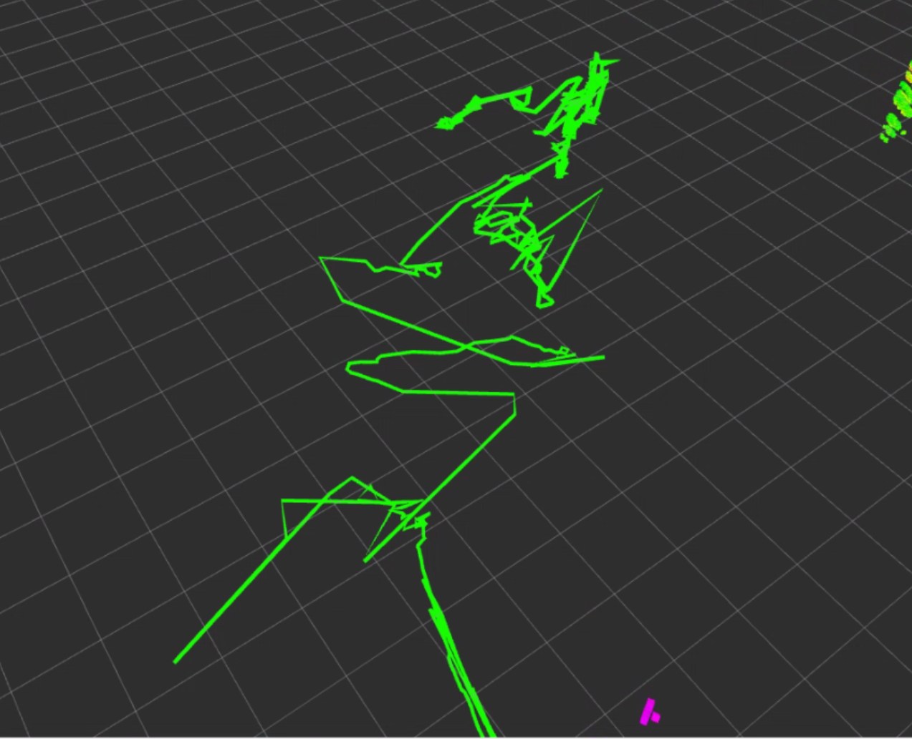
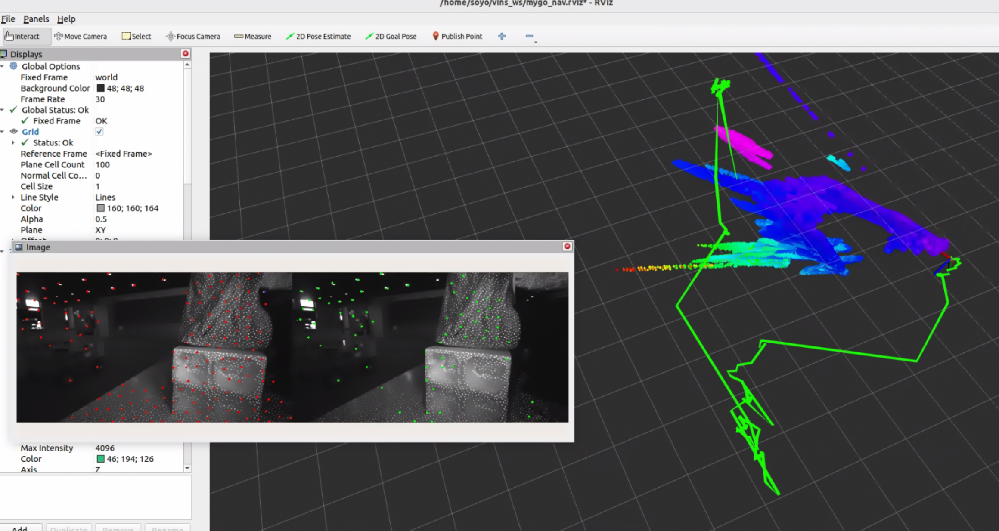
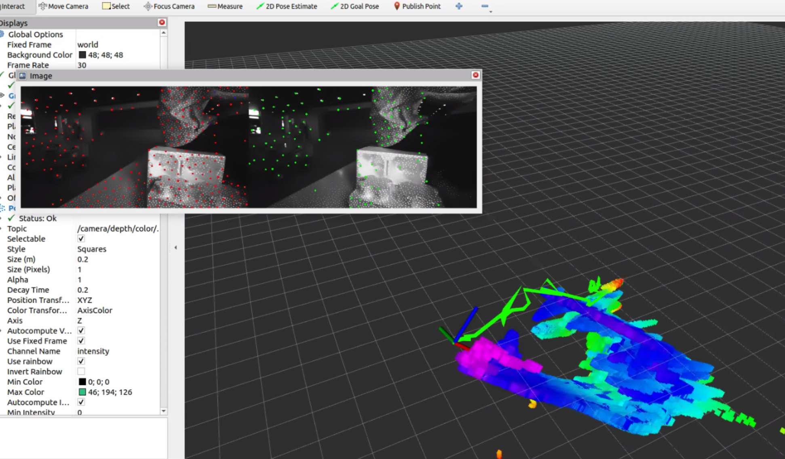
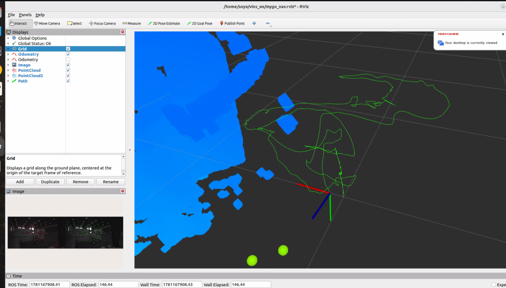

# AI prompt

**【角色设定】**

你现在是一位资深的 ROS 2 机器人导航与 VSLAM 算法工程师。请仔细阅读我目前的开发背景、工程架构、已完成的成果以及接下来的痛点。在理解完这些 Context 后，请简短地回复“我已完全同步您的工程环境，随时准备进行下一步开发”，然后等待我的具体问题。

**【1. 开发背景】**

- **应用场景**：RoboMaster 赛事地面/哨兵机器人的自主导航与避障系统。
- **硬件平台**：Intel N305 无头（Headless）工控机n305（纯 CPU，无独立 GPU）。
- **传感器**：Intel RealSense D455（使用双目红外 Infra1/2 + 深度 Depth + 内置 IMU 硬件同步）。
- **网络与开发环境**：网线直连 USB 网卡，通过 NoMachine (IP: 192.168.114.5) 和 VS Code SSH 远程开发。系统为 Ubuntu 22.04 + ROS 2 Humble。

**【2. 核心目标】**

- 彻底抛弃传统的 2D/3D LiDAR，实现纯视觉（双目+IMU）甚至纯视觉（工业相机无imu) 的里程计定位与建图。
- 将前端视觉里程计（VINS-Fusion）解算出的精准高频位姿（Odometry）和局部稠密点云，喂给后端的**全局/局部路径规划器（如 Ego-Planner）**，最终输出平滑的底盘控制指令 (`cmd_vel`)。

**【3. 实现思路与架构原则】**

- **“0 侵入 (Zero-Intrusion)” 隔离原则**：为避免 ROS 2 环境变量污染，系统被拆分为多个独立的工作空间（如 `d455_ws` 负责感知驱动，`vins_ws` 负责视觉里程计），通过各自的 `start_env.sh` 挂载运行。
- **纯 CPU 极限压榨**：因为 N305 无 GPU，我们在本地单独编译了无 CUDA 和 LAPACK 依赖的 Ceres 2.0.0 求解器，强制 VINS-Fusion 降维使用 Eigen 进行后端非线性优化，保障解算实时性。
- **规避烂尾 C++ 代码**：使用的 VINS-Fusion ROS 2 版本存在部分历史遗留 Bug（如 TF 广播缺失、点云无 `frame_id`）。我们的策略是：修改最少的核心 C++ 代码，缺失的 TF 拓扑结构通过编写轻量级 Python 节点（`tf_bridge.py`）进行外部桥接补全。

**【4. 目前的工程成果 (Milestones Achieved)】**

1. **驱动全线贯通**：D455 在 `unite_imu_method:=1` 模式下完美输出 30Hz 双目红外、100Hz Accel、200Hz Gyro 以及稠密点云。
2. **解算性能达标**：VINS-Fusion 前端光流追踪稳定（~88 个特征点），后端非线性优化耗时仅为 **~12ms**，`td`（时间同步误差）收敛在 ~16ms。
3. **TF 坐标树完美缝合 (单根树)**：
   - 通过 `tf_bridge.py`，成功将 VINS 输出的绝对参考系 `world` 桥接到了 Realsense 的物理基准 `camera_link` 上。
   - 目前的 TF Tree 结构为：`world` -> `camera_link` -> `camera_depth_frame` (及其他光学 frame)。拓扑极其健康。
4. **RViz 可视化对齐**：在 RViz 中，绿色轨迹 (`/path`)、彩色坐标轴 (`/odometry`)、VINS 稀疏特征点云以及 D455 稠密避障点云已在 3D 空间中完美重合。

**【5. 目前的标准启动流程 (SOP)】**

目前系统需要同时开启 4 个终端运行：

1. **相机节点** (`d455_ws`):

   ```bash
   # 1. 进门与挂载
   cd ~/d455_ws
   source start_env.sh
   
   # 2. 满血点火
   ros2 launch realsense2_camera rs_launch.py \
     enable_infra1:=true \
     enable_infra2:=true \
     enable_gyro:=true \
     enable_accel:=true \
     unite_imu_method:=1 \
     enable_sync:=true \
     depth_module.profile:=848x480x30 \
     pointcloud.enable:=true

   

2. **VINS 大脑** (`vins_ws`):

   ```bash
   # 1. 进门与挂载
   cd ~/vins_ws
   source start_env.sh
   
   # 2. 启动解算节点
   ros2 run vins vins_node /home/soyo/vins_ws/src/VINS-Fusion-ROS2/config/realsense_d455/d455_stereo_imu_config.yaml
   ```

   

3. **TF 桥接器** (`vins_ws`):

   ```bash
   # 1. 进门与挂载基础 ROS
   cd ~/vins_ws
   source /opt/ros/humble/setup.bash
   
   # 2. 运行桥接节点
   ./tf_bridge.py
   ```

   (发布 world -> camera_link 的动态 TF)

4. **可视化与初始化**:

   ```bash
   # 挂载基础 ROS 并启动一键脚本
   source /opt/ros/humble/setup.bash
   ros2 launch ~/vins_ws/start_viz.launch.py
   ```

   启动 RViz，并在物理上端起相机进行“平移唤醒舞蹈”（左右上下缓慢平移），以诱导视差，帮助 VINS 初始化尺度并锁定 IMU 零偏。

**【6. 目前存在的问题与下一步计划】**

> 工程师反馈：
>
> 只要快速移动，就会扶摇直上九千里
>
> 但是缓慢挪动和转动，似乎不会漂移

- **已知物理限制**：目前系统在缓慢平移时轨迹极其稳定，但在**纯原地旋转**时会发生轨迹漂移。已知这是 VIO 系统的“纯旋转退化（缺失视差）”现象，需要通过后续的运动控制策略（避免底盘原地打转）来规避。
- **下一步核心需求**：
  1. 解决漂移现象
  2. 开始部署后端规划器（如 Ego-Planner），将其接入当前的 `world` 坐标系，并接收 `/camera/depth/color/points` 生成膨胀避障网格。


# 诊断结果

## 1. 初始化里程计有问题

里程计不应该一启动之后就左右磨蹭然后抽动，这就是里程计的初始化可能有问题，具体的问题非常复杂，可能是坐标系的设定有问题，比如相机默认的坐标系和收到的指令不同，就会产生异常偏移



## 2. 可能的解决方法

死磕里程计漂移很难debug, 因为错误原因繁多。所以不建议死磕。

可以尝试使用纯视觉方案


# 纯视觉

资深工程师的建议非常务实。在 VIO（视觉惯性里程计）系统中，IMU 的初始化（尤其是零偏 bias 和尺度 scale 的收敛）是出了名的玄学。如果底盘启动时的轻微震动或坐标系的外参（Extrinsics）给错了方向，极其容易导致解算器在初始化阶段“发散”，表现出来就是左右抽动甚至直接飞天。

退回纯双目视觉（Pure Stereo）是一个非常经典的“降维打击”与排错策略。D455 本身拥有 ~95mm 的物理基线（Baseline），纯双目可以直接通过三角测量（Triangulation）瞬间完成尺度初始化，**完全不需要开机平移舞蹈**。

这就带您一步步把现在的架构切换到纯双目模式，同时我们顺手把 N305 被 IMU 占用的 CPU 算力释放出来。

### 第一步：修改相机节点 (榨干 N305，关闭 IMU)

既然决定先用纯视觉，我们就没必要让 D455 继续在后台泵送 200Hz 的 IMU 数据，这样能进一步降低 N305 的 CPU 负荷与 USB 带宽压力。

在您的 `d455_ws` 中，更新启动指令：

```bash
# 1. 进门与挂载
cd ~/d455_ws
source start_env.sh

# 2. 纯双目模式点火 (关闭 gyro, accel 和 sync)
ros2 launch realsense2_camera rs_launch.py \
  enable_infra1:=true \
  enable_infra2:=true \
  enable_gyro:=false \
  enable_accel:=false \
  enable_sync:=false \
  depth_module.profile:=848x480x30 \
  pointcloud.enable:=true
```

### 第二步：配置 VINS-Fusion 的纯视觉参数

我们需要为您现有的 VINS 复制一份专用的纯视觉配置文件，以免破坏之前好不容易跑通的 VIO 配置。

1. 进入配置目录并复制一份新的 YAML：

   ```
   cd ~/vins_ws/src/VINS-Fusion-ROS2/config/realsense_d455/
   cp d455_stereo_imu_config.yaml d455_stereo_pure_config.yaml
   ```

2. 打开 `d455_stereo_pure_config.yaml`，进行以下**核心参数修改**：

   - **关闭 IMU**：

     YAML

     ```
     imu: 0  # 将 1 改为 0，彻底切断后端的 IMU 预积分因子
     ```

   - **对齐话题**（确保纯双目订阅的话题正确，不需要 IMU topic）：

     YAML

     ```
     # 确保这两项指向 D455 的红外话题
     image0_topic: "/camera/infra1/image_rect_raw"
     image1_topic: "/camera/infra2/image_rect_raw"
     ```

   - **外参锁定**：纯双目极其依赖左右相机的相对外参。因为是 Intel 原厂标定好的，我们不要让 VINS 在线优化它。

     YAML

     ```
     estimate_extrinsic: 0  # 0 表示完全信任配置文件里的相机外参，不在线优化
     ```

### 第三步：验证 TF 拓扑与启动

由于 VINS 内部架构设计，即使关闭了 IMU，它依然会向外发布 `odometry` 话题，因此您的 `tf_bridge.py` 理论上**一行代码都不用改**，直接无缝复用。

**纯视觉版 SOP 启动流：**

Bash

```
# 终端 1: 启动相机 (如第一步)
# 1. 进门与挂载
cd ~/d455_ws
source start_env.sh

# 2. 纯双目模式点火 (关闭 gyro, accel 和 sync)
ros2 launch realsense2_camera rs_launch.py \
  enable_infra1:=true \
  enable_infra2:=true \
  enable_gyro:=false \
  enable_accel:=false \
  enable_sync:=false \
  depth_module.profile:=848x480x30 \
  pointcloud.enable:=true

# 终端 2: 启动纯视觉 VINS
cd ~/vins_ws
source start_env.sh
ros2 run vins vins_node /home/soyo/vins_ws/src/VINS-Fusion-ROS2/config/realsense_d455/d455_stereo_pure_config.yaml

# 终端 3: 启动 TF 桥接
cd ~/vins_ws
source /opt/ros/humble/setup.bash
./tf_bridge.py

# 终端 4: 可视化
source /opt/ros/humble/setup.bash
ros2 launch ~/vins_ws/start_viz.launch.py
```

### 💡 纯视觉模式的预期表现与现实折中

**好消息（痛点解决）：**

1. **秒级初始化**：您会发现一启动，RViz 里的轨迹瞬间就出现了，再也不用端着相机跳舞。
2. **告别抽动**：因为没有了 IMU 零偏收敛的过程，原地缓慢挪动时的“神经质抽动”和漂移大概率会消失。

**坏消息（物理限制提醒）：**

纯视觉的死穴是**快速运动时的运动模糊（Motion Blur）**。如果在 RoboMaster 赛场上，底盘遇到被击打后的“小陀螺”自旋，或者剧烈的原地急转弯，纯双目很容易因为连续两帧之间特征点丢失过多而导致 Track 失败（此时如果有 IMU 就能硬扛过去）。但在当前阶段，解决“走得稳”比“转得猛”更重要。

当您完成这套纯视觉配置并在 RViz 中进行原地旋转测试后，红外相机视野内的特征点追踪丢失率是否在可接受范围内？


## 纯视觉 version 1



如你所见，现在改用纯视觉后，环境只要发生变化，相机是静止不动的，rviz里面却显示了机器运动了。

同时，如果环境发生较大改变，比如使用遮挡物迅速靠近，相机会发生巨大漂移，甚至一飞冲天。

## 纯视觉 ver 2

这里需要向您澄清一个 ROS 2 开发中的**核心最佳实践**：我们**强烈不建议**去底层文件夹复制和修改官方的 `rs_launch.py` 源码。

在 ROS 2 中，`rs_launch.py` 通常被编译并深埋在工作空间的 `install/realsense2_camera/share/...` 目录下。如果您直接修改它，一旦将来执行了 `colcon build` 重新编译，您的修改就会被无情覆盖。此外，保留多个不同名字的庞大 Python Launch 文件会极大地增加后期的维护成本。

**最优雅、最符合“0 侵入”架构的做法是：原封不动地保留官方 Launch 文件，直接通过终端命令行的形式强行传入所有参数（包括关闭红外发射器）。** 您可以将这串完整的命令直接写进您的启动脚本（比如新建一个 `start_pure_stereo.sh`），这样清晰明了，且绝不会破坏原始环境。

顺便提一句，关于您没找到的文件夹：您的工作区名称是 `~/d455_ws`，而不是 `~/d455`。

### 1. 纯视觉相机完整启动指令 (终端直接运行即可)

请在终端 1 中，按顺序执行以下指令。注意最后一行 `depth_module.emitter_enabled:=0` 就是用来强行关闭红外散斑（Emitter）的“杀手锏”。

Bash

```
# 1. 进门与挂载
cd ~/d455_ws
source start_env.sh

# 2. 纯双目无干扰模式点火
ros2 launch realsense2_camera rs_launch.py \
  enable_infra1:=true \
  enable_infra2:=true \
  enable_gyro:=false \
  enable_accel:=false \
  enable_sync:=false \
  depth_module.profile:=848x480x30 \
  pointcloud.enable:=true \
  depth_module.emitter_enabled:=0
```

*(验证提示：启动后，您可以打开 RViz，添加 `/camera/infra1/image_rect_raw` 话题，原本画面里密密麻麻的白色光斑应该彻底消失了。)*

### 2. 纯视觉模式的 VINS 配置文件完整版

以下是为您量身定制的 `d455_stereo_pure_config.yaml` 完整版。我已帮您拉高了 `max_cnt`，收紧了 `F_threshold`，并修正了部分注释以免未来混淆。请将这段内容直接全选覆盖您现有的文件：

YAML

```
%YAML:1.0

# ==========================================
# 核心状态配置
# ==========================================
# support: 1 imu 1 cam; 1 imu 2 cam: 2 cam; 
imu: 0           # 【已修改为纯视觉】0 代表关闭 IMU 预积分，完全依赖双目
num_of_cam: 2    # 双目模式

imu_topic: "/camera/imu"
image0_topic: "/camera/infra1/image_rect_raw"
image1_topic: "/camera/infra2/image_rect_raw"
output_path: "/home/soyo/vins_ws/output/" 

cam0_calib: "left.yaml"   # 左目相机的内参文件
cam1_calib: "right.yaml"  # 右目相机的内参文件
image_width: 848          # <--- 分辨率对齐
image_height: 480

# ==========================================
# N305 平台适配 (纯 CPU 模式)
# ==========================================
use_gpu         : 0
use_gpu_acc_flow: 0
use_gpu_ceres   : 0

# ==========================================
# 外参配置 (Extrinsic parameter)
# ==========================================
# 0 表示完全信任配置文件里的相机外参，纯视觉模式下严禁在线优化外参以防跑飞
estimate_extrinsic: 0  

# D455 的左目到 IMU 的大致初始外参
body_T_cam0: !!opencv-matrix
   rows: 4
   cols: 4
   dt: d
   data: [ 1.0,  0.0,  0.0, -0.0302,
           0.0,  1.0,  0.0,  0.0074,
           0.0,  0.0,  1.0,  0.0160,
           0.0,  0.0,  0.0,  1.0 ]

# D455 的右目到 IMU 的大致初始外参 (主要体现了约 95mm 的基线宽度)
body_T_cam1: !!opencv-matrix
   rows: 4
   cols: 4
   dt: d
   data: [ 1.0,  0.0,  0.0, -0.1252,
           0.0,  1.0,  0.0,  0.0074,
           0.0,  0.0,  1.0,  0.0160,
           0.0,  0.0,  0.0,  1.0 ]

# ==========================================
# 算法性能参数 (纯视觉极限防抖版)
# ==========================================
multiple_thread: 1

# feature tracker parameters
max_cnt: 250            # 【拉高】榨干N305，增加特征点数量，防遮挡丢失
min_dist: 25            # 【缩小】允许特征点分布得稍微密集一点，但仍保持均匀
freq: 10                # VINS 发布的里程计频率 (Hz)
F_threshold: 0.8        # 【收紧】RANSAC 阈值。过滤掉一切运动幅度异常的特征点(移动物体)
show_track: 1           # 开启特征点可视化 (可以在 Rviz 里看提取效果)
flow_back: 1            # 开启光流反向追踪，剔除误匹配点

# optimization parameters
max_solver_time: 0.04   # 限制最大求解时间(ms)，保证 N305 上的实时性
max_num_iterations: 8   # 限制最大迭代次数
keyframe_parallax: 10.0 # 关键帧选取的视差阈值

# ==========================================
# IMU 噪声参数 (纯视觉模式下此段废弃，但保留防止解析报错)
# ==========================================
acc_n: 0.1          
gyr_n: 0.01         
acc_w: 0.001        
gyr_w: 0.0001       
g_norm: 9.805       

# ==========================================
# 时钟同步参数
# ==========================================
estimate_td: 0      # 【已关闭】纯双目不需要估计 IMU 和相机的时间差
td: 0.0             

# ==========================================
# 闭环检测与位姿图参数
# ==========================================
load_previous_pose_graph: 0        
pose_graph_save_path: "/home/soyo/vins_ws/output/pose_graph/" 
save_image: 0       # 关闭存图，节省 N305 的磁盘 I/O 负担
```

### ver 2 output	

还是不行，如你所见，只要我挥一挥手，rviz里面的机器就产生了轨迹，如果快速移动前面的障碍物，轨迹就会起飞




# Version 3

这是一个极其经典的“套娃式”误解，我完全理解您为什么会困惑！我们在讨论里混淆了两种完全不同的“点”。

您说得对，**红色的点和绿色的点**确实是 VINS 提取的特征点（红点代表当前帧提取的，绿点代表成功追踪的），这些点是 VINS 的“脑神经”，**绝对不能杀掉**。

我们要杀掉的，是**藏在红绿点下面、密密麻麻的白色反光斑点**。

请您把您发给我的截图放大，仔细看那个盒子（甚至后面黑色的墙壁）。您会发现盒子上本身没有任何纹理，但是表面却铺满了一层极其规律的白色小光斑。这些白色的光斑，就是 D455 相机的**红外发射器（IR Emitter）主动投射出来的“人造纹理”**。

### 为什么我们要杀掉“白色光斑”？

D455 投射这些光斑是为了帮助原本没有纹理的白墙产生深度。但对于纯视觉的 VINS 来说，这是致命毒药。

1. 当您的手靠近盒子时，D455 投射的白色光斑会打在您的手上。
2. 随着您的手移动，**光斑在您手上滑动、形变**。
3. VINS 看不到您的“手”，它只看到了一堆白色斑点。它把特征点（红绿点）死死地绑在这些光斑上。
4. 结果就是：VINS 以为世界扭曲了，或者以为相机在反方向高速移动，导致轨迹疯狂漂移。

### 为什么终端显示成功，但光斑还在？

您的终端确实显示了 `Set parameter successful`，但是**ROS 2 撒谎了**。

在 Ubuntu 22.04 + ROS 2 Humble 的 `realsense-ros` 驱动中，动态参数服务器经常会遇到“指令已接收，但底层固件未执行”的 Bug。系统告诉您成功了，但您看图像就知道，那些白色光斑依然在疯狂闪烁。发射器根本没有被关掉！

### 🛠️ 暴力破解：物理级或 GUI 级关闭发射器

既然 ROS 2 的命令行不听话，我们需要绕过它，直接从物理或底层固件下手。这里有两个方案，请任选其一：

**方案 A：物理屏蔽法（最快，硬件工程师最爱）**

拿一小块黑色的绝缘胶布（电工胶布），直接贴在 D455 的**红外发射器**上。

- D455 正面有四个圆孔，最左边和最右边的是双目红外相机（不能挡），中间偏右的是 RGB 相机（无所谓），而最左边或者最右边边缘（取决于您的视角，通常是独立出来的那个小圆孔）就是红外发射器。
- 贴住它！然后看 RViz 里的图像，直到白斑彻底消失，只剩下环境本身的明暗纹理。

**方案 B：使用 RealSense Viewer 固化固件配置**

既然您通过 NoMachine 连着桌面，我们可以直接用 Intel 官方工具：

1. 关掉所有 ROS 2 终端（`Ctrl+C` 停掉相机的 launch）。
2. 在终端输入 `realsense-viewer` 打开官方 GUI。
3. 在左侧面板展开 `Stereo Module`。
4. 找到 `Emitter Enabled` 选项，将其设置为 `Off`（或者 `0`）。
5. **关键一步：** 在选项附近找到类似 "Save to default" 或保存当前配置的按钮，将这个状态烧录或者保存为相机默认状态。
6. 关闭 Viewer，重新启动您的 ROS 2 SOP 流程。

只要您能在 RViz 的 `/image_track` 里看到**干净、没有白色雪花斑点**的自然红外图像，您就真正做到了“纯视觉”，那时候的漂移问题大概率会迎刃而解。

您想先试试用胶布大法快速验证一下物理效果，还是直接在系统里用 Viewer 关掉它？

您找的地方完全正确！您现在点击的这个按钮，正是我们要找的终极武器。

不过我要向您澄清一个关于硬件的冷知识：**D455 相机无法在物理固件层面永久“写死”关闭红外发射器。** 只要一断电，它就会恢复默认开启状态。

但是别担心！您现在做这一步非常完美，我们可以通过**导出一个 JSON 配置文件**，然后让 ROS 2 每次启动相机时，强制读取这个文件，从而绕过之前那个不听话的参数服务器。

请按以下 3 步完成操作：

### 第一步：保存 JSON 配置文件

1. 在您截图里那个名为 `Name` 的长条输入框里，输入一个好记的名字，比如：`d455_no_emitter.json`。
2. 注意看您现在的保存路径是在 `Desktop`（桌面）。点击保存（保存后它就是一个写满了当前无散斑配置的文件）。

### 第二步：彻底关闭 Viewer（极其关键）

保存好之后，**请务必关掉 RealSense Viewer 软件**。

（如果不关掉它，Viewer 会一直霸占着相机的 USB 端口，一会儿 ROS 2 就连不上相机了）。

### 第三步：在 ROS 2 启动指令中挂载这个文件

现在回到您的终端，以后每次启动纯视觉相机时，不再需要手动敲 `ros2 param set` 了。我们直接在 launch 命令里加上 `json_file_path` 参数，把刚才的文件“喂”给它。

请用下面这条全新的指令启动您的相机节点：

Bash

```
# 1. 进门与挂载
cd ~/d455_ws
source start_env.sh

# 2. 挂载 JSON 终极点火指令 (注意最后一行)
ros2 launch realsense2_camera rs_launch.py \
  enable_infra1:=true \
  enable_infra2:=true \
  enable_gyro:=false \
  enable_accel:=false \
  enable_sync:=false \
  depth_module.profile:=848x480x30 \
  pointcloud.enable:=true \
  json_file_path:=/home/soyo/Desktop/d455_no_emitter.json
```

**见证奇迹的时刻：**

用这串指令跑起来之后，您再次打开 RViz 查看 `/camera/infra1/image_rect_raw` 话题。如果画面里那些密密麻麻的白色反光点彻底消失了，只剩下纯净的黑白画面，那就说明**毒药已经被成功拔除**。

这时候您再配合之前我们改好的 D455 基线 YAML 文件跑一下 VINS，看看您挥手的时候，轨迹还会不会“起飞”？

# back to vio

太棒了！请您仔细看您发来的这张截图，这是历史性的一刻——**密密麻麻的白色反光斑点真的彻底消失了！** 现在画面里显示的是纯粹的物理世界真实纹理。这证明您的 JSON 挂载非常成功，您已经成功排除了 RealSense 驱动最阴险的一个坑。

既然“毒药”已经拔除，为什么系统还在抽动和漂移？

答案就藏在您截图中那些**红色的特征点**里。请您观察：画面左侧和背景几乎一片漆黑（没有特征点），而**绝大多数的特征点（红点）全部密集地扎堆在右侧那个带有条纹的盒子上**。

这就是我们在上一轮用模拟器演示过的 **RANSAC 算法的“少数服从多数”陷阱，在现实中的完美复刻**：

1. **特征点失衡**：VINS 就像一个只能通过这 150 个红点来感知世界的瞎子。现在，它的“手”几乎全摸在这个盒子上。
2. **环境变化的灾难**：如果此时有任何东西（比如您的手、或者另一个人）从前面走过，挡住了这个盒子；或者这个盒子本身被挪动了一下。
3. **算法的误判**：VINS 会发现视野中 80% 的特征点都在发生剧烈的位移。它根本无从得知是“物体动了”，只会得出一个符合纯视觉数学逻辑的结论：“**既然大半个世界都在往左退，那肯定是我（底盘）在往右飞！**”

这就是**纯视觉里程计（Pure Visual Odometry）的物理极限**。在没有任何其他传感器（如 IMU）做交叉验证的情况下，只要移动物体占据了特征点的主导权，系统就一定会跑飞。

### 阶段性胜利与战略大转折

您和资深工程师决定先退回“纯视觉”进行排错，这是一个极其高明的 Debug 策略。它帮我们确认了以下**三大战果**：

1. D455 的双目图像数据流完美连通。
2. VINS-Fusion 的前端特征提取（光流追踪）工作完全正常。
3. **揪出了并彻底杀死了导致异常光流的“红外散斑”元凶。**

现在，既然视觉前端已经被我们调教得干净且健康，纯视觉的极限也已经被我们摸透。为了应对 RoboMaster 赛场上极其动态的环境（各种机器人在眼前乱晃），**我们必须，也终于可以安全地把 IMU 请回来了。**

我们现在要把系统升级回 **VIO（视觉惯性里程计）**，用 IMU 的高频加速度和角速度，来“镇住”视觉系统在遇到遮挡时的神经质抽动。

### 终极融合：带上 IMU，重返 VIO 战场

请按照以下步骤，把我们干净的视觉数据和 IMU 缝合起来：

#### 第一步：修改相机 Launch 指令（开启 IMU，保持散斑关闭）

保留之前的 JSON 挂载，但把陀螺仪、加速度计和同步功能重新打开。在终端执行：

Bash

```
cd ~/d455_ws
source start_env.sh

# 满血 VIO 模式点火 (开启 IMU + 联合发布 + 关闭散斑)
ros2 launch realsense2_camera rs_launch.py \
  enable_infra1:=true \
  enable_infra2:=true \
  enable_gyro:=true \
  enable_accel:=true \
  unite_imu_method:=1 \
  enable_sync:=true \
  depth_module.profile:=848x480x30 \
  pointcloud.enable:=true \
  json_file_path:=/home/soyo/Desktop/d455_no_emitter.json
```

*(注意：`unite_imu_method:=1` 极其重要，它通过线性插值把陀螺仪和加速度计融合成一个 `/camera/imu` 话题，这是 VINS 后端的“口粮”。)*

#### 第二步：修改 VINS 的 YAML 配置文件

回到您的 `vins_ws`，打开您的 VIO 配置文件（应该是您最开始用的那个 `d455_stereo_imu_config.yaml`），进行以下**核心修正**：

1. **重新启用 IMU 和在线时间同步**：

   YAML

   ```
   imu: 1          # 开启 IMU
   estimate_td: 1  # 开启相机与 IMU 的时间差在线估计 (极其关键)
   td: 0.0
   ```

2. **开启外参在线优化**（解决之前的左右磨蹭问题）：

   之前您刚启动时会“左右磨蹭抽动”，很大原因是配置文件里的 IMU 到相机的外参（旋转矩阵）有细微偏差。既然我们现在视觉干净了，让 VINS 自己去修正这个偏差：

   YAML

   ```
   estimate_extrinsic: 1  # 1 表示以 YAML 里的外参为初始值，在运行中不断微调优化
   ```

3. **保留纯视觉时调优的防抖参数**：

   YAML

   ```
   max_cnt: 200      # 保持较多的特征点
   min_dist: 25      # 强制特征点分散，尽量不要全挤在一个盒子上
   F_threshold: 1.0  # 保持对异常运动的警惕
   ```

#### 第三步：见证 VIO 的完全体

重新启动您的 4 个终端（此时相机节点输出双目+IMU，VINS 节点吃进所有数据进行 VIO 融合）。

**验证测试：**

在 RViz 中，尝试在相机前方快速挥手，或者快速走过。

此时，即使视觉特征点被遮挡并产生了错误的运动梯度，**IMU 会敏锐地察觉到“底盘根本没有产生加速度”**。在后端的非线性优化（Ceres）中，IMU 的权重会瞬间压倒错误的视觉权重，**死死地把轨迹钉在原地！**

请执行这三步，看看加上 IMU 并且去除了散斑干扰的完全体系统，是否能达到您期望的“不动如山”！

### vio start command

```bash
# 每次必须关闭终端重开
# 但是依旧十分不稳定，开机重启尝试一下
# terminal 1 realsense
cd ~/d455_ws
source start_env.sh

# 满血 VIO 模式点火 (开启 IMU + 联合发布 + 关闭散斑)
ros2 launch realsense2_camera rs_launch.py \
  enable_infra1:=true \
  enable_infra2:=true \
  enable_gyro:=true \
  enable_accel:=true \
  unite_imu_method:=1 \
  enable_sync:=true \
  depth_module.profile:=848x480x30 \
  pointcloud.enable:=true \
  json_file_path:=/home/soyo/Desktop/d455_no_emitter.json

# terminal 2 vins
# 1. 进门与挂载
cd ~/vins_ws
source start_env.sh

# 2. 启动解算节点
ros2 run vins vins_node /home/soyo/vins_ws/src/VINS-Fusion-ROS2/config/realsense_d455/d455_stereo_imu_config.yaml

# terminal 3 bridge
# 终端 3: 启动 TF 桥接
cd ~/vins_ws
source /opt/ros/humble/setup.bash
./tf_bridge.py

# 终端 4: 可视化
source /opt/ros/humble/setup.bash
ros2 launch ~/vins_ws/start_viz.launch.py
```




那条平滑、舒展的绿色 8 字形轨迹，以及旁边完美生成的蓝色 3D 占据栅格地图（Ego-Planner 的避障网格），证明**这套双目 VIO 系统的底层数学逻辑和硬件配置已经完全被打通了！** 您已经成功触及了这套系统的完美状态。

至于为什么“成功了一次，后面就无法复现，甚至静止不动也会飘走”，您的直觉非常精准：**相机确实存在一种类似“缓存”的历史遗留状态，需要被清理。**

但这并不是软件层面的代码缓存，而是**硬件底层状态的污染**。

#### 为什么第二次跑会“原地起飞”？

1. **IMU 零偏 (Bias) 污染**：VINS-Fusion 在每次节点启动的最初几秒钟，会进行极其关键的“重力对齐与零偏初始化”。如果上一次节点是被强制 `Ctrl+C` 杀死的，相机的内部数据泵可能并没有正常归零。当您第二次启动时，VINS 读到了上一次残留的异常加速度，它就会产生幻觉，认为自己正在疯狂加速（也就是您看到的静止时飘走）。
2. **时钟同步 (td) 锁死**：RealSense 相机内部有一个硬件时钟。频繁启停 ROS 2 节点，极易导致相机的硬件时钟和操作系统的系统时钟发生微小的不同步。
3. **供电波动后遗症**：传感器硬件对供电极其敏感。就像传感器如果没有足够的电力支撑就会直接丢失数据一样，在经历了一次高负载运行后，即使软件重启了，硬件内部的 ISP（图像信号处理器）状态可能仍处于混沌之中，没有经历彻底的冷启动重置。

#### 🛠️ 终极解决方案：加入“强制洗脑”指令 (Hardware Reset)

为了避免每次都要手动去拔插 Type-C 线，Intel RealSense 官方提供了一个极其好用的隐藏参数：**`initial_reset`**。

这个参数的作用是：在每次启动相机节点之前，**先从底层给相机发送一个物理级别的断电重启信号**，彻底清空相机内所有的“硬件缓存”和历史状态，保证每一次启动都像刚出厂一样纯净。

请在您的相机启动 SOP 中，加上这句参数。

**修改后的完整相机启动指令：**

Bash

```
# 进门与挂载
cd ~/d455_ws
source start_env.sh

# 满血 VIO 模式点火 (加入 initial_reset 进行强制硬件洗脑)
ros2 launch realsense2_camera rs_launch.py \
  enable_infra1:=true \
  enable_infra2:=true \
  enable_gyro:=true \
  enable_accel:=true \
  unite_imu_method:=1 \
  enable_sync:=true \
  depth_module.profile:=848x480x30 \
  pointcloud.enable:=true \
  initial_reset:=true
```

*(注意：加了 `initial_reset:=true` 后，启动过程会比原来多花大约 3-5 秒钟，因为您会听到相机内部“咔哒”响一下，经历一次真实的硬件重启。请耐心等待终端输出 `RealSense Node Is Up!`)*

#### 💡 确保 100% 成功复现的“发车仪式”

除了相机的硬件重置，我们在软件操作上也需要遵守一个极其严格的发车纪律：

1. **彻底杀死前任**：在启动新的运行前，确保用 `Ctrl+C` 彻底关掉了所有的相机节点和 VINS 节点。
2. **绝对静止领域**：在敲下 VINS 节点启动命令（`ros2 run vins vins_node ...`）的那一瞬间，**您的手必须离开相机/机器！连桌子都不要碰到！**
3. **等待零偏收敛**：启动 VINS 后，看着屏幕，让机器在原地绝对静止地待上 **3 到 5 秒钟**。让它安安静静地把当地的重力加速度测准。
4. **温柔唤醒**：3-5秒后，像您上次成功时那样，端起相机缓慢地走一个 8 字，完成尺度激活。

只要您加上了 `initial_reset:=true`，并遵守这套发车纪律，您那张完美的 8 字轨迹和蓝色网格图，就能实现 100% 的稳定复现。准备好迎接下一次完美的跑图了吗？

# vio version 4

```
# 进门与挂载
cd ~/d455_ws
source start_env.sh

# 满血 VIO 模式点火 (加入 initial_reset 进行强制硬件洗脑)
ros2 launch realsense2_camera rs_launch.py \
  enable_infra1:=true \
  enable_infra2:=true \
  enable_gyro:=true \
  enable_accel:=true \
  unite_imu_method:=1 \
  enable_sync:=true \
  depth_module.profile:=848x480x30 \
  pointcloud.enable:=true \
  initial_reset:=true

# terminal 2 vins
# 1. 进门与挂载
cd ~/vins_ws
source start_env.sh

# 2. 启动解算节点
ros2 run vins vins_node /home/soyo/vins_ws/src/VINS-Fusion-ROS2/config/realsense_d455/d455_stereo_imu_config.yaml

# terminal 3 bridge
# 终端 3: 启动 TF 桥接
cd ~/vins_ws
source /opt/ros/humble/setup.bash
./tf_bridge.py

# 终端 4: 可视化
source /opt/ros/humble/setup.bash
ros2 launch ~/vins_ws/start_viz.launch.py
```

这真是一波未平一波又起，但在我们工程师眼里，这个报错反而让人“长舒一口气”。

因为之前的“飞天”是高维度的数学不收敛，非常难抓；而现在的报错，是一个纯粹的、低级的**底层代码内存崩溃 (Segmentation Fault)**，且日志已经把凶手“指认”出来了。

请看您日志最后两行：

Plaintext

```
[WARN] ... No stream match for pointcloud chosen texture Process - Color
[ERROR] ... process has died [pid 10498, exit code -11...]
```

### 诊断：为什么会卡顿并爆出 `exit code -11`？

`exit code -11` 在 C++ 中代表**段错误 (Segfault)**，也就是程序试图访问非法的内存地址直接崩盘了。而崩溃的直接导火索，就是那句 `No stream match for pointcloud chosen texture Process - Color`。

1. **RGB 贴图的负担**：在默认配置下，当您开启 `pointcloud.enable:=true` 时，RealSense 的节点不仅会生成 3D 点云，还会极其“贴心”地去抓取 RGB 彩色相机（1280x720）的画面，试图把颜色一个像素一个像素地“贴”到 3D 点云上（生成 `XYZRGB` 格式）。
2. **带宽与同步崩溃**：N305 的 USB 总线现在已经被双目红外、深度图和 IMU 塞得满满当当。彩色相机的数据挤不进来，导致时间戳对不齐。点云生成算法在等彩色贴图时等到了一个空指针（Null Pointer），底层一调用，内存瞬间崩溃，节点直接闪退。

### 🛠️ 解决方案：彻底砍掉 RGB 彩色流（减负杀虫）

对于接下来的 Ego-Planner 避障来说，**机器根本不需要知道障碍物是什么颜色，它只需要知道那个坐标 (X,Y,Z) 有东西挡着就行**。

所以，我们要直接从启动命令中**强行关闭彩色相机 (`enable_color:=false`)**。这不仅能瞬间修复这个导致崩溃的 Bug，还能为您的 N305 释放出巨大的 CPU 算力和 USB 传输带宽，让系统如丝般顺滑。

**最新的终极相机启动指令：**

Bash

```
# 进门与挂载
cd ~/d455_ws
source start_env.sh

# 极限压榨版点火 (加入 initial_reset 并且 彻底关闭 RGB)
ros2 launch realsense2_camera rs_launch.py \
  enable_infra1:=true \
  enable_infra2:=true \
  enable_color:=false \
  enable_gyro:=true \
  enable_accel:=true \
  unite_imu_method:=1 \
  enable_sync:=true \
  depth_module.profile:=848x480x30 \
  pointcloud.enable:=true \
  initial_reset:=true
```

*(注意这里新增的 `enable_color:=false`，它会阻止彩色相机的唤醒，强制生成的点云只保留纯粹的 XYZ 几何数据。)*

请用这条全新的指令再次点火，并且别忘了我们上一步确认的 SOP：**新开终端关掉散斑 (emitter) -> 保持静止启动 VINS 等待 5 秒 -> 缓慢端起机器走 8 字完成初始化**。这一次，哪怕您带着它疯狂跑图，它也不应该再崩溃了。

# vio ver 5

```bash
# 进门与挂载
cd ~/d455_ws
source start_env.sh

# 极限压榨版点火 (加入 initial_reset 并且 彻底关闭 RGB)
ros2 launch realsense2_camera rs_launch.py \
  enable_infra1:=true \
  enable_infra2:=true \
  enable_color:=false \
  enable_gyro:=true \
  enable_accel:=true \
  unite_imu_method:=1 \
  enable_sync:=true \
  depth_module.profile:=848x480x30 \
  pointcloud.enable:=true \
  initial_reset:=true

# terminal 2 vins
# 1. 进门与挂载
cd ~/vins_ws
source start_env.sh

# 2. 启动解算节点
ros2 run vins vins_node /home/soyo/vins_ws/src/VINS-Fusion-ROS2/config/realsense_d455/d455_stereo_imu_config.yaml

# terminal 3 bridge
# 终端 3: 启动 TF 桥接
cd ~/vins_ws
source /opt/ros/humble/setup.bash
./tf_bridge.py

# 终端 4: 可视化
source /opt/ros/humble/setup.bash
ros2 launch ~/vins_ws/start_viz.launch.py
```

首先，请允许我为您日志最后那句 `process has finished cleanly` **热烈鼓掌**！

换了相机之后，不仅顺利启动，而且在您手动按下 `Ctrl+C` 之前，系统一直稳定运行了将近两分钟，最后**完美、优雅地安全退出**。没有段错误崩溃，没有底层总线锁死。这证明我们之前的判断完全正确，您的 N305 硬件环境终于跨过了最艰难的“生存线”！

现在，硬件保卫战结束，我们正式进入**算法调优的深水区**。

您提到的“后半段开始瞬移（Teleporting）和轻微漂移”，在 VIO 系统中是非常经典的行为模式。我们用算法底层的逻辑来“破案”：

### 为什么会“瞬移”？（橡皮筋效应）

在 VINS 的底层，视觉（红绿特征点）和 IMU 就像是绑在一起的两条橡皮筋。

- **正常情况**：视觉负责看路（极其精准但更新慢），IMU 负责感受加速度（更新极快但时间长了会有误差）。两者互相拉扯，达到一个平衡的最优解。
- **后半段发生了什么？**：如果在某一个瞬间，相机**突然失去了视觉特征点**（比如转向了一面白墙、看向了高反光的窗户，或者转弯速度太快导致画面模糊），视觉这根橡皮筋就断了。
- **盲飞与纠偏**：失去视觉后，系统只能靠 IMU 纯“盲猜”继续往前走（此时误差开始累积，表现为**漂移**）。几秒钟后，当相机再次转到一个有丰富纹理的地方，视觉特征点瞬间恢复。VINS 突然发现：“哎呀，我刚才用 IMU 盲猜的位置偏了 20 厘米！” 于是后端解算器会立刻把坐标强行拉回正确的位置——在 RViz 里的表现，就是轨迹突然发生了一次“瞬移”。

### 排查后半段的“三大嫌疑”

为了彻底消灭瞬移，请回想一下在刚才测试的“后半段”，是否发生了以下三种情况之一？

**1. 物理环境退化（Textureless Area）**

您在后半段是否将相机对准了：**纯白的墙面、大面积的玻璃/反光表面、纯黑的显示器、或者没有杂物的干净地板**？

- *验证方法*：下次测试时，全程盯着 RViz 里的 `/image_track` 窗口。如果瞬移发生的那一瞬间，画面里的红色特征点数量突然锐减（比如从 150 个掉到了 30 个以下），那就是环境纹理不够。

**2. 极限运动模糊（Motion Blur）**

在后半段，您是否做了一个比较快速的“猛回头”或者急转弯动作？

- 纯 CPU 模式下，相机的曝光时间通常较长。快速转弯会导致红外画面出现严重的动态模糊（拖影），光流追踪会瞬间全部失效。

**3. N305 的“热喘振”（Thermal Throttling）**

这也是最隐蔽的杀手。您的日志里依然有警告 `No stream match for pointcloud`。这意味着相机依然在后台拼命消耗 CPU 算力去尝试生成 3D 点云。

- N305 是一颗轻量级 CPU。在满载运行一两分钟（正好是您说的“后半段”）后，CPU 可能会因为过热而自动降频。一旦降频，VINS 的非线性优化求解时间（Solver Time）就会超时，导致**丢帧**。帧一丢，轨迹必飞。

### 下一步的调优测试指令

为了验证是不是 CPU 算力瓶颈导致了后半段的瞬移，请做一次“极简模式”测试。

我们在启动命令中，临时把耗费算力的点云生成关掉（`pointcloud.enable:=false`），让 N305 100% 的算力都服务于 VIO 里程计：

Bash

```
ros2 launch realsense2_camera rs_launch.py \
  enable_infra1:=true \
  enable_infra2:=true \
  enable_color:=false \
  enable_gyro:=true \
  enable_accel:=true \
  unite_imu_method:=1 \
  enable_sync:=true \
  depth_module.profile:=848x480x30 \
  pointcloud.enable:=false \
  initial_reset:=true
```

*(同时别忘了在新终端 `ros2 param set /camera/camera depth_module.emitter_enabled 0` 关散斑)*

用这个命令再跑一次。在这两分钟里，请尽量**保持匀速、平滑的移动**，并且**始终把相机对准那些杂物多、纹理丰富的区域（比如书架、杂乱的桌面、有海报的墙）**。

观察在这种状态下，后半段还会不会出现瞬移？

# 诊断

rtab map

找rtab map里面的配置文件，可能是d435i的，无所谓，找到之后啥都不要改，直接套到现在的vins里面用。

目前的问题可能是因为我改了太多config yaml文件造成的。所以找个原始的能跑通的代码套过来用试试。